```{r setup, include=FALSE}
options(htmltools.dir.version = FALSE)
```

layout: true
class: split-30

.row.bg-main1[.content.vmiddle.center[
.font4[What is Machine Learning?]
]]

.row[.content[
  .split-70[
  .column[.content.vmiddle.center[
  .font3[“The field of study that gives computers the ability to learn **without being explicitly programmed**.”]
]]
  .column[.content.vmiddle.right[
  .padding[.img-fill[]]
  ]]
  ]]]
  

???

---

class: hide-row2-col1 hide-row2-col2

---

class: hide-row2-col2
count: false

---

count: false

---

layout: true
class: split-30

.row.bg-main1[.content.vmiddle.center[
.font4[What is Machine Learning?]
]]

.row[.content[
  .split-two[
  .column[.content.vtop.center[
  .font2[Supervised Learning]
  .padding[
  .img-fill[]
  ]]]
  .column[.content.vtop.center[
  .font2[Unsupervised Learning]
  .padding[
  .img-fill[]
  ]]
  ]]
  ]]
  
---

class: hide-row2-col1 hide-row2-col2

---

class: hide-row2-col2
count: false

---

count: false

---

layout: false
class: split-20

.row.bg-main1[.content.vmiddle.center[
.font4[What is Supervised Learning?]
]]

.row[.content.vmiddle.center[
# **GOAL**: create a predictive model

]]

???
supervised learning is done using a ground truth.

goal of supervised learning is to learn a function that, given a sample of data and desired outputs, best approximates the relationship between input and output observable in the data

if the output label is a real number, we call the task regression. If the label is from the limited number of values, where these values are unordered, then it’s classification.

---

layout: true
class: split-20

.row.bg-main1[.content.vmiddle.center[
.font4[What is Supervised Learning?]
]]

.row[.content[.split-two[
  .column[.content.vtop.center[
  .font2[Regression]<br>
  <br>
  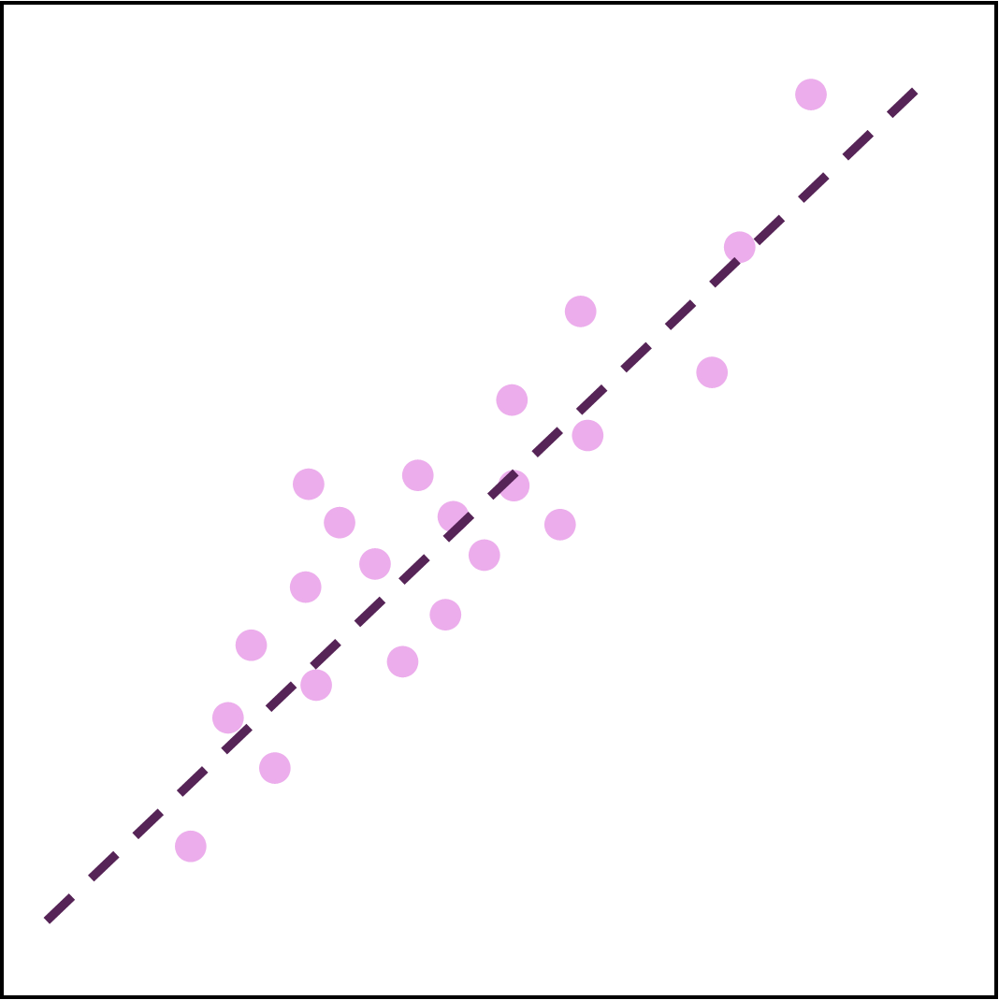
  ]]
  .column[.content.vtop.center[
  .font2[Classification]<br>
  <br>
  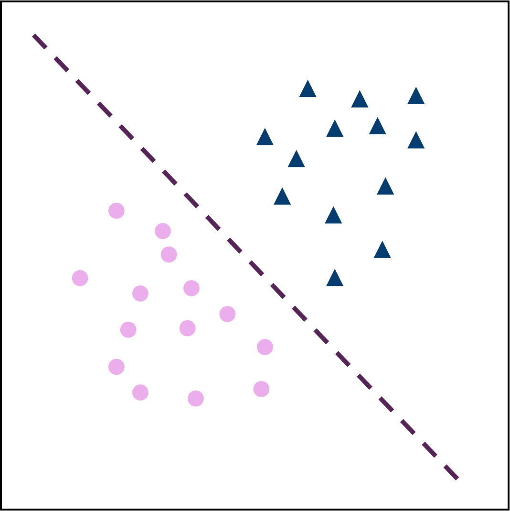
  ]]
  ]]]


???
# classification
- k-nearest neighbours
- trees

#regression
- liner regression
- decison trees & random forest

---

class: hide-row2-col1 hide-row2-col2

---

class: hide-row2-col2
count: false

---

count: false

---

layout: false
class: split-20

.row.bg-main1[.content.vmiddle.center[
.font4[What is Unsupervised Learning?]
]]

.row[.content.vmiddle.center[
# **GOAL**: create a descriptive model

]]

???
does not have labeled outputs, 

goal is to infer the natural structure present within a set of data points

---

layout: false
class: split-20

.row.bg-main1[.content.vmiddle.center[
.font4[What is Unsupervised Learning?]
]]

.row[.content.vtop.center[
  .font2[Clustering]<br>
  <br>
  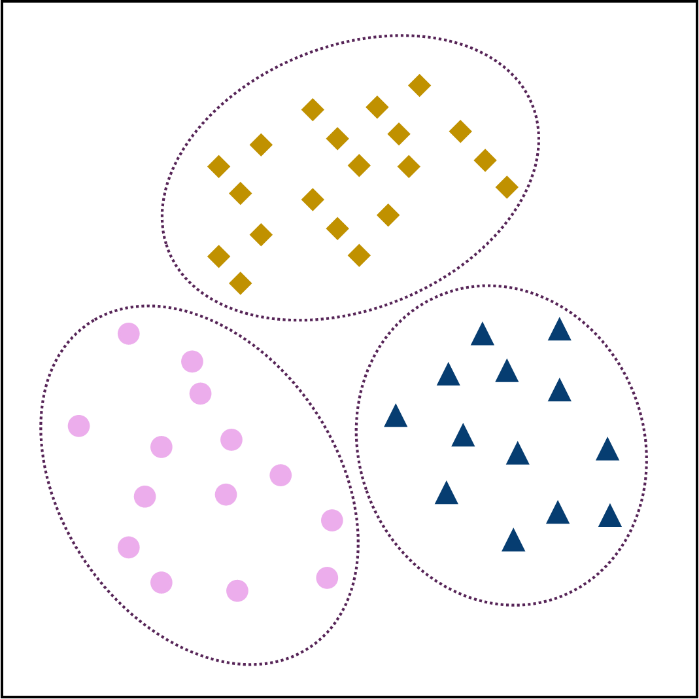
  ]]

---

layout: false
class: split-20

.row.bg-main1[.content.vmiddle.center[
.font4[Supervised Learning: Decision Trees]
]]

.row[.content.vmiddle.center[
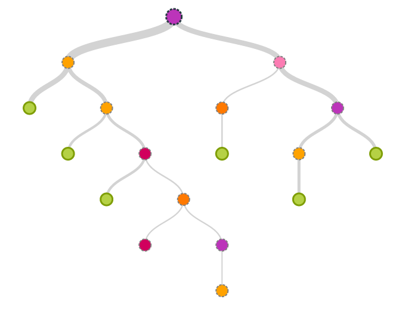
]]

???
# Pros
- simple to understand and interpret
- Works with both numerical and categorical data

# Cons
- Easy to overfit the tree

# A decision tree uses if-then statements to define patterns in data.
If the price of a house is above some value, then the house is probably in some Cape Town.
These statements are called forks and split the data into two **branches**

The initial split might will likely classify some homes into the wrong category and we call these **false negatives** and **false postives**

The next step in the process is to look at the subset of the data looking at a different variable, maybe the size of the house provides the next split for houses the model is placing in Johannesburg while the year built provides a better split for houses that model predicts are in Cape Town.  This repetition is called **recursion**.  Deciding on which variable provides the best split is determined using a mathematical model, typically we look at the minimising the error.

We grow the tree until we meet a predefined stopping point.

Then we test the tree using data that was not provided to train the model.  

---

layout: false
class: split-20

.row.bg-main1[.content.vmiddle.center[
.font4[Supervised Learning: Decision Trees]
]]

.row[.content.vmiddle.center[
  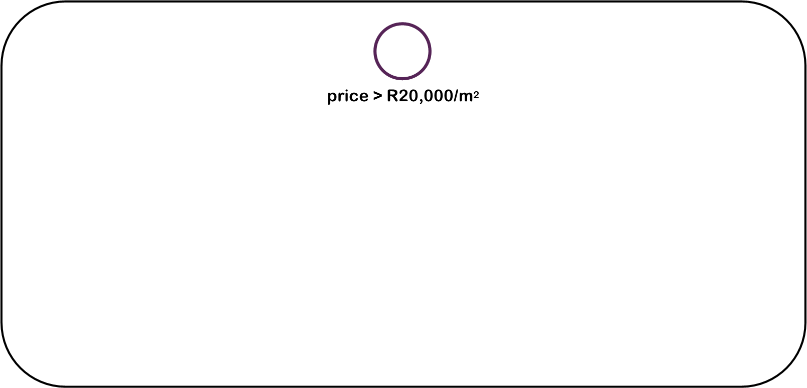
  ]]

---

layout: false
class: split-20
count: false

.row.bg-main1[.content.vmiddle.center[
.font4[Supervised Learning: Decision Trees]
]]

.row[.content.vmiddle.center[
  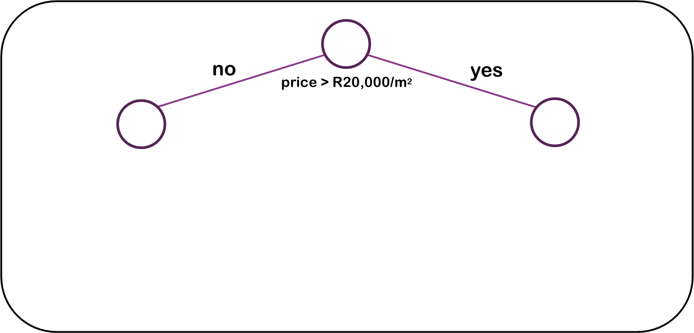
  ]]
  
---

layout: false
class: split-20
count: false

.row.bg-main1[.content.vmiddle.center[
.font4[Supervised Learning: Decision Trees]
]]

.row[.content.vmiddle.center[
  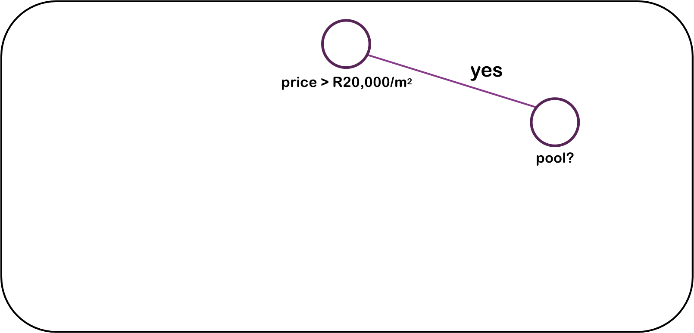
  ]]
  
---

layout: false
class: split-20
count: false

.row.bg-main1[.content.vmiddle.center[
.font4[Supervised Learning: Decision Trees]
]]

.row[.content.vmiddle.center[
  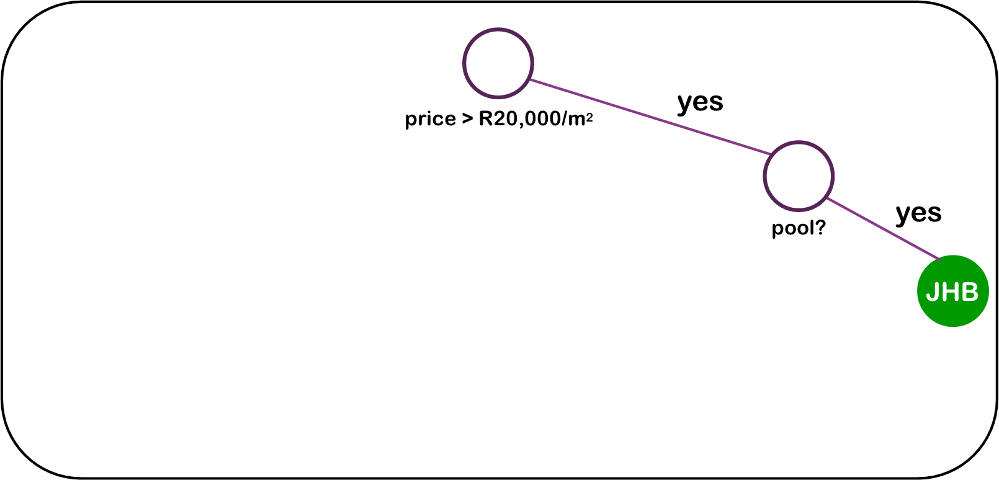
  ]]
  
---

layout: false
class: split-20
count: false

.row.bg-main1[.content.vmiddle.center[
.font4[Supervised Learning: Decision Trees]
]]

.row[.content.vmiddle.center[
  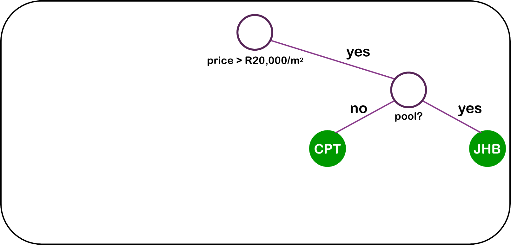
  ]]

---

layout: false
class: split-20
count: false

.row.bg-main1[.content.vmiddle.center[
.font4[Supervised Learning: Decision Trees]
]]

.row[.content.vmiddle.center[
  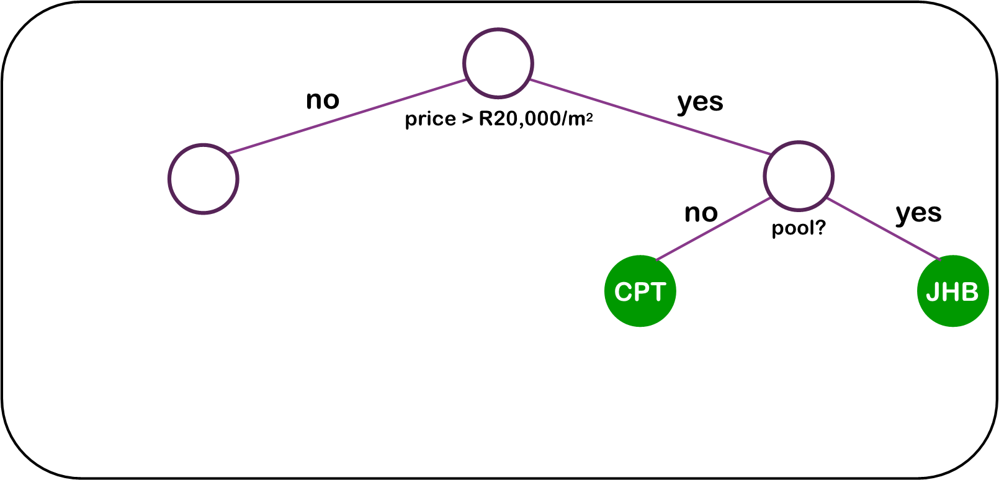
  ]]
  
---

layout: false
class: split-20
count: false

.row.bg-main1[.content.vmiddle.center[
.font4[Supervised Learning: Decision Trees]
]]

.row[.content.vmiddle.center[
  
  ]]

---

layout: false
class: split-20
count: false

.row.bg-main1[.content.vmiddle.center[
.font4[Supervised Learning: Decision Trees]
]]

.row[.content.vmiddle.center[
  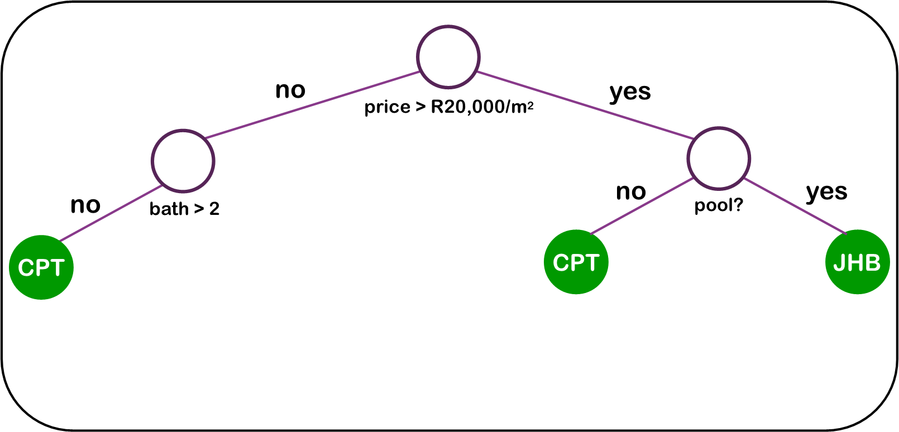
  ]]
  
---

layout: false
class: split-20
count: false

.row.bg-main1[.content.vmiddle.center[
.font4[Supervised Learning: Decision Trees]
]]

.row[.content.vmiddle.center[
  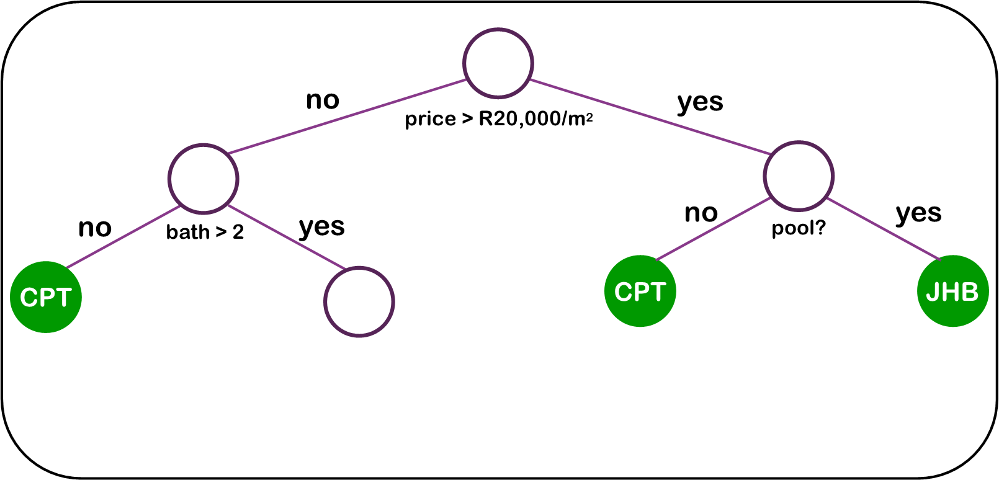
  ]]

---

layout: false
class: split-20
count: false

.row.bg-main1[.content.vmiddle.center[
.font4[Supervised Learning: Decision Trees]
]]

.row[.content.vmiddle.center[
  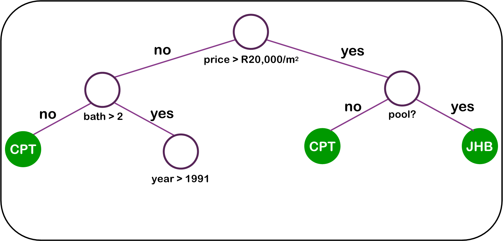
  ]]
  
---

layout: false
class: split-20
count: false

.row.bg-main1[.content.vmiddle.center[
.font4[Supervised Learning: Decision Trees]
]]

.row[.content.vmiddle.center[
  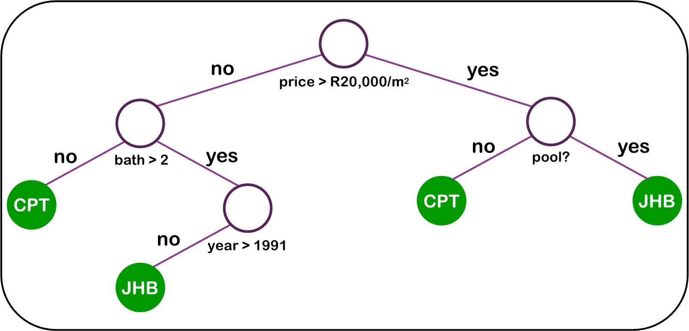
  ]]

---

layout: false
class: split-20
count: false

.row.bg-main1[.content.vmiddle.center[
.font4[Supervised Learning: Decision Trees]
]]

.row[.content.vmiddle.center[
  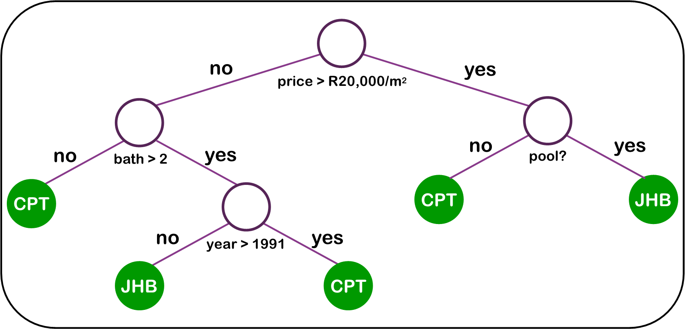
  ]]
  
---

class: split-70 hide-slide-number
background-image: url("bkgs/bg_r.jpg")
background-size: cover

.column.slide-in-left[
.sliderbox.vmiddle.shade_main.left[
.font5[R and RStudio]]]
.column[
]

---
layout: false
class: split-20

.row.bg-main1[.content.vmiddle.center[
.font4[RLadies & R Users Groups]
]]

.row[.content[.split-two[
  .column[.content.vmiddle.center[
  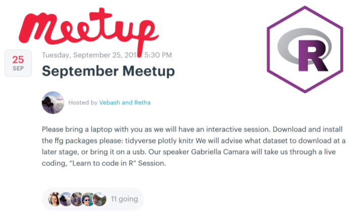
  ]]
  .column[.content.vmiddle.center[
  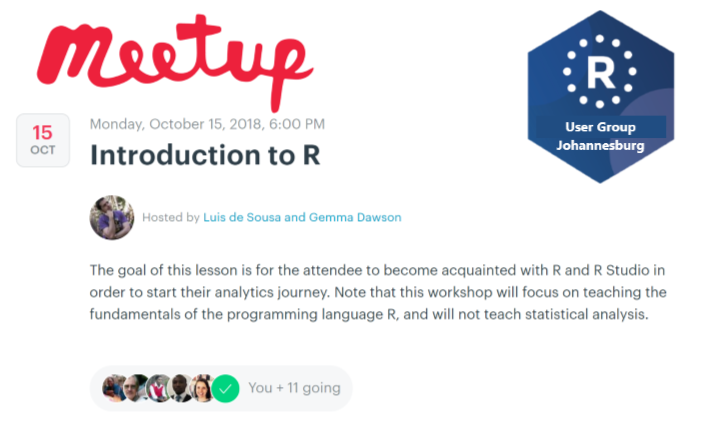
  ]]
  ]]]

---

layout: false
class: split-70 hide-slide-number
background-image: url("bkgs/titanic.jpg")
background-size: cover

.column.slide-in-left[
.sliderbox.vmiddle.shade_main.left[
.font5[Titanic]<br>
.font3[Machine Learning from Disaster]]]
.column[
]

---

layout: true
class: split-20

.row.bg-main1[.content.vmiddle.center[
.font4[Machine Learning from Disaster]
]]

.row[.split-two[
  .column[.content.vtop[
  [](https://www.kaggle.com/c/titanic)
  # training.csv
  .font2[891 entries]<br>
  .font2[11 variables]
<br>
  # test.csv
  .font2[418 entries]<br>
  .font2[10 variables]
  ]]
  .column[.content.vmiddle.center[
  ### **GOAL**: predict tof the Titanic's passengers survived
  
  ]]
]]

???
https://www.kaggle.com/c/titanic

April 15 1912

---

class: hide-row2-col1 hide-row2-col2

---

class: hide-row2-col2
count: false

---

count: false

---

layout: true
class: split-30 with-border

.column[.split-two[
  .row.bg-main1[.content.vmiddle.left[
    # Load libraries
  ]]
  .row.bg-main1[.content.vmiddle.left[
    # Import the data
  ]]
]]

.column[.split-two[
  .row.bg-black[.content.vmiddle.left[
    ```{r message=FALSE}
    library(tidyverse)
    library(rpart)
    library(rpart.plot)
    ```
  ]]
  .row.bg-black[.content.vmiddle.left[
    ```{r message = FALSE}
    titanic <- read_csv(file = "data/titanic.csv", col_names = TRUE)
    ```
  ]]
]]

---

class: hide-row1-col2 hide-row2-col1 hide-row2-col2 

---

class: hide-row2-col1 hide-row2-col2
count: false

---

class: hide-row2-col2
count: false

---

count: false

---

layout: false
class: split-10 with-border
.row.bg-main1[.content.vmiddle.left[
  # Let's look at the data
]]
.row.bg-black[.content.vtop.left[
  ```{r}
  head(titanic)
  ```
]]

---

layout: false
class: split-10 with-border
.row.bg-main1[.content.vmiddle.left[
  # Tidy & Transform
]]
.row.bg-black[.content.vtop.left[
  ```{r}
  summary(titanic$Pclass)
  titanic$Pclass <- as.factor(titanic$Pclass)
  
  summary(titanic$Pclass)
  ```
]]

---

layout: false
class: split-10 with-border
.row.bg-main1[.content.vmiddle.left[
  # Tidy & Transform
]]
.row.bg-black[.content.vtop.left[
  ```{r}
  summary(titanic$Survived)
  titanic$Survived <- if_else(titanic$Survived == 1, 
                                "yes",
                                "no")
  
  summary(titanic$Survived)
  ```
]]

---

layout: false
class: split-10 with-border
.row.bg-main1[.content.vmiddle.left[
  # Tidy & Transform
]]
.row.bg-black[.content.vtop.left[
  ```{r}
  summary(titanic$Age)
  titanic$Age <- if_else(is.na(titanic$Age), 
                            mean(titanic$Age, na.rm = T), 
                            titanic$Age)
  
  summary(titanic$Age)
  ```
]]

---

layout: false
class: split-10 with-border
.row.bg-main1[.content.vmiddle.left[
  # Tidy & Transform
]]
.row.bg-black[.content.vtop.left[
  ```{r}
  titanic$Family <- titanic$SibSp + titanic$Parch
  
  summary(titanic$Family)
  ```
]]

---

layout: false
class: split-10 with-border
.row.bg-main1[.content.vmiddle.left[
  # Tidy & Transform
]]
.row.bg-black[.content.vtop.left[
  ```{r}
  titanic <- titanic %>% 
                select(Pclass, Sex, Age, Fare, Family, Survived)

  glimpse(titanic)
  ```
]]

---

layout: false
class: split-10 with-border
.row.bg-main1[.content.vmiddle.left[
  # Model
]]
.row.bg-black[.content.vtop.left[
  ```{r fig.show("hold")}
  tree.titanic <- rpart(formula = Survived ~ ., data = titanic)
  
  rpart.plot(tree.titanic, fallen.leaves = F)
  ```
]]

---

layout: false
class: split-10 with-border

.row.bg-main1[.content.vmiddle.left[
 # Visualise & Communicate
]]

.row[.content.vmiddle.center[
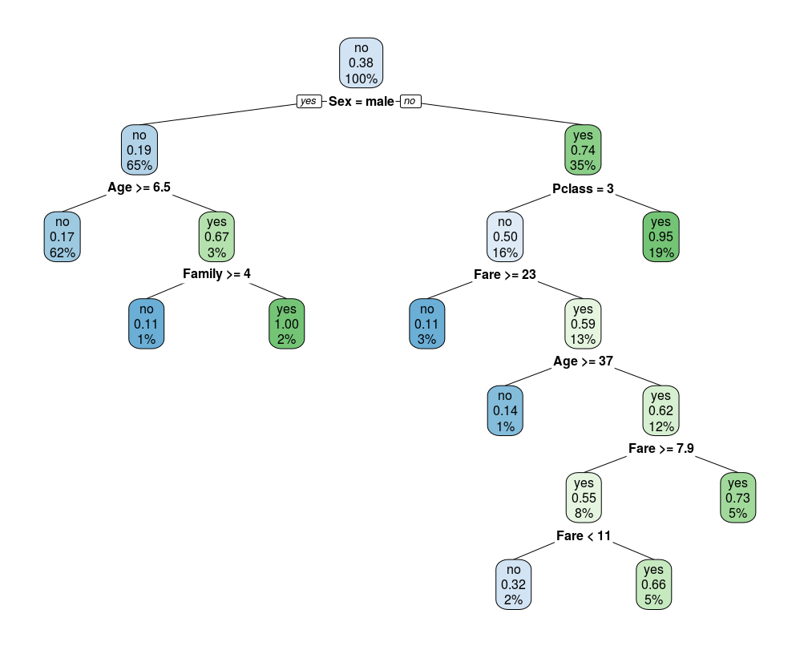
]]

---

layout: false
class: split-10 with-border

.row.bg-main1[.content.vmiddle.left[
 # Predict
]]

.row[.content.vmiddle.center[
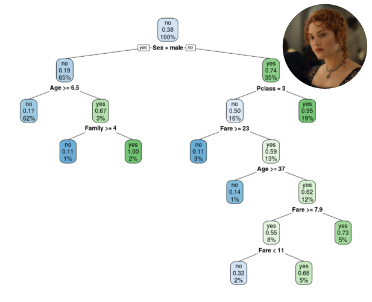
]]

---

layout: false
class: split-10 with-border
count: false

.row.bg-main1[.content.vmiddle.left[
 # Predict
]]

.row[.content.vmiddle.center[

]]

---

layout: false
class: split-10 with-border
count: false

.row.bg-main1[.content.vmiddle.left[
 # Predict
]]

.row[.content.vmiddle.center[

]]

---

layout: false
class: split-10 with-border

.row.bg-main1[.content.vmiddle.left[
 # Predict
]]

.row[.content.vmiddle.center[
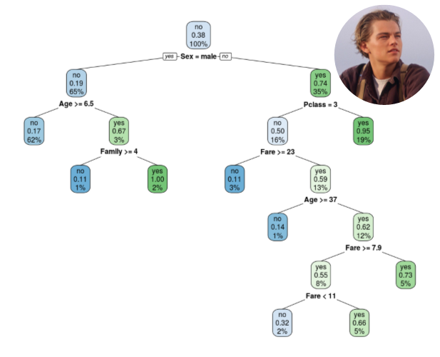
]]

---

layout: false
class: split-10 with-border
count: false

.row.bg-main1[.content.vmiddle.left[
 # Predict
]]

.row[.content.vmiddle.center[

]]

---

layout: false
class: split-10 with-border
count: false

.row.bg-main1[.content.vmiddle.left[
 # Predict
]]

.row[.content.vmiddle.center[

]]

---

layout: false
class: split-10 with-border
count: false

.row.bg-main1[.content.vmiddle.left[
 # Predict
]]

.row[.content.vmiddle.center[
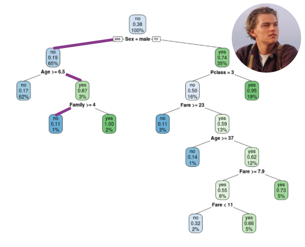
]]

---

layout: false
class: split-10 with-border
count: false

.row.bg-main1[.content.vmiddle.left[
 # But we all know that Jack could have survived`r anicon::faa("angry", animate="burst", colour="red")`
]]

.row[.content.vmiddle.center[
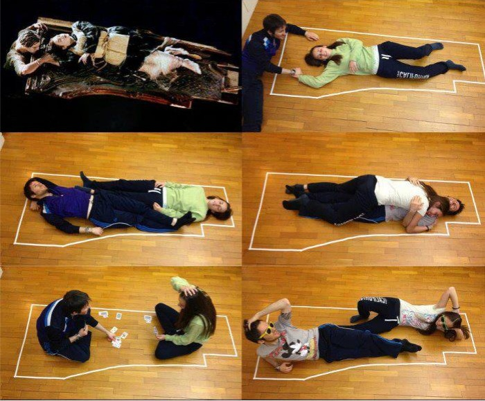
]]

---

layout: false
class: split-10 with-border
.row.bg-main1[.content.vmiddle.left[
  # Import, Tidy, & Transform the Test Data
]]
.row.bg-black[.content.vtop.left[
  ```{r message = FALSE}
  # Import the test.csv file
  titanic.test <- read_csv(file = "data/test.csv", col_names = TRUE)
  
  # Convert the Passenger Class to a factor
  titanic.test$Pclass <- as.factor(titanic.test$Pclass)
  
  # Tidy the missing Age observations
  titanic.test$Age <- if_else(is.na(titanic.test$Age), 
                                mean(titanic$Age, na.rm = T),   
                                titanic.test$Age)
  
  # Create the Family variable
  titanic.test$Family <- titanic.test$SibSp + titanic.test$Parch
  
  # Grab the variables we originally used
  titanic.test <- titanic.test %>%
                    select(PassengerId, Pclass, Sex, Age, Fare, Family)
  ```
]]

---

layout: false
class: split-10 with-border
.row.bg-main1[.content.vmiddle.left[
  # Import, Tidy, & Transform the Training Data
]]
.row.bg-black[.content.vtop.left[
  ```{r}
  titanic.test$Predict <- predict(tree.titanic, titanic.test, type = "class")
  
  summary(titanic.test$Predict)
  
  titanic.test$Survived <- if_else(titanic.test$Predict == "yes", 1, 0)
  
  titanic.submit <- titanic.test %>% 
                      select(PassengerId, Survived)
  
  
  write.csv(titanic.submit, file = "data/titanic_answer.csv", row.names = FALSE)
  ```
]]

---

layout: false
class: split-10 with-border
count: false

.row.bg-main1[.content.vmiddle.left[
 # How did we do?
]]

.row[.content.vmiddle.center[
<br>
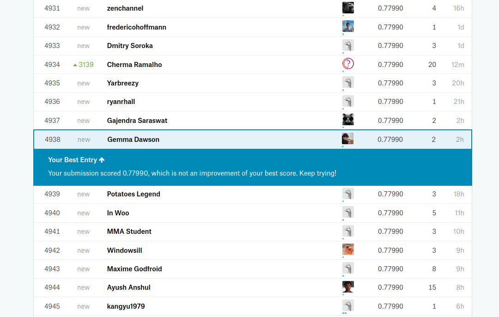
]]

---

layout: false
class: split-60 hide-slide-number
background-image: url("bkgs/desktopbw.jpg")
background-size: cover

.column.slide-in-left[
.sliderbox.vmiddle.shade_main.left[
  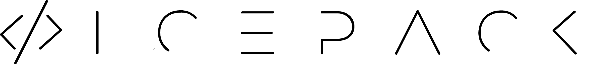<br>
  .font5[Gemma Dawson]
]]

.column[.content.vmiddle.right[
### .indigo[`r anicon::faa("laptop", animate="float")`  www.icepack.ai]
### .indigo[`r anicon::faa("github", animate="float")`  @GemmaDawson]
### .indigo[`r anicon::faa("twitter", animate="float")`  @gemmadawsonza]
]]

---

layout: false
class: split-30

.row.bg-main1[.content.vmiddle.center[
.font4[Thank you]
]]

.row[.content[
  .split-70[
  .column[.content.vmiddle.center[
  
]]
  .column[.content.vmiddle.center[
  <br>
  # Emi Tanaka
  ### .deep-purple[`r anicon::faa("github", animate="float")`  @emitanaka]
  ### .deep-purple[`r anicon::faa("twitter", animate="float")`  @statsgen]
]]
  ]]
  ]]]